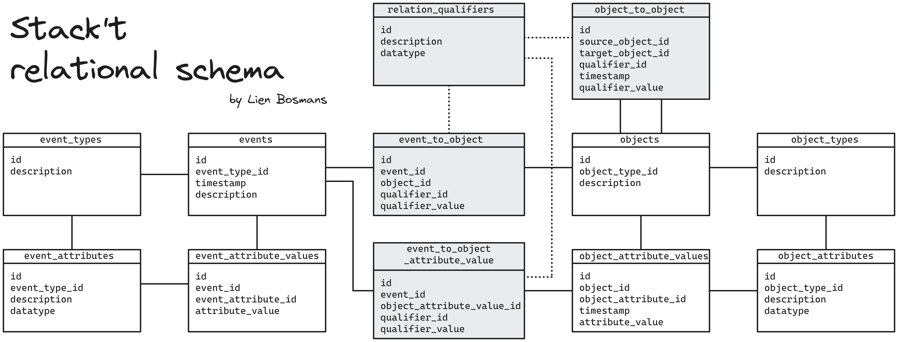
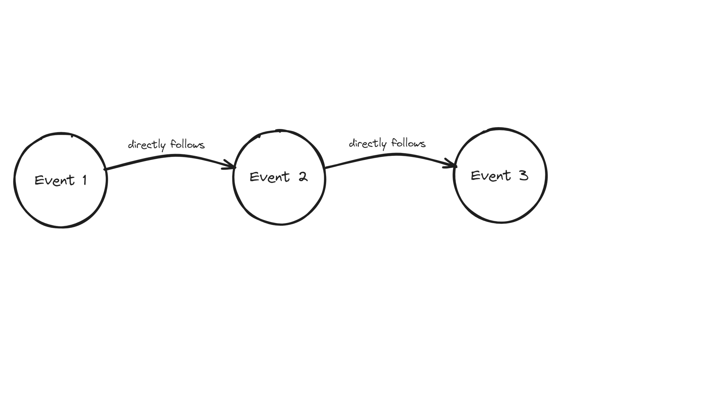
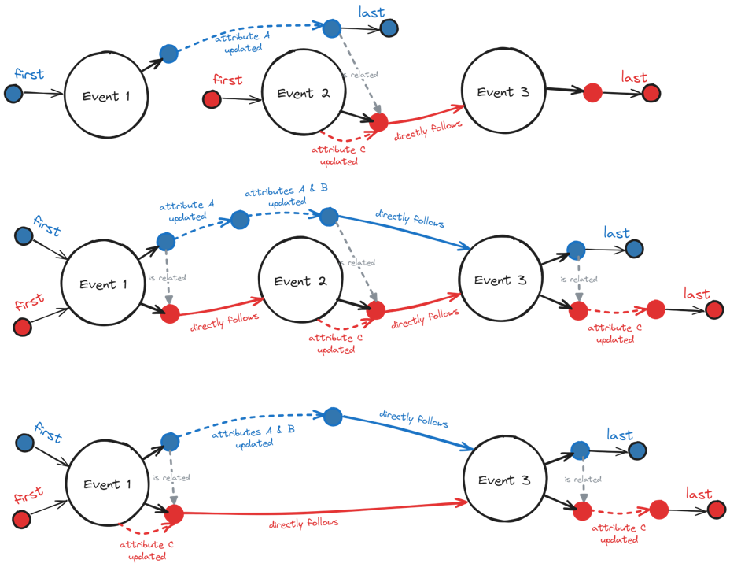
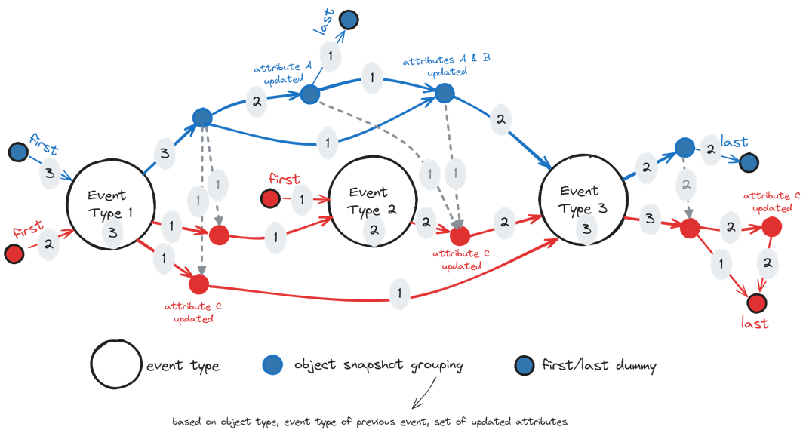

# Stack't

Stack't is a small data stack (DuckDB + dbt) in a box (Docker container with Python image), that specializes in data ingestion and transformation for object-centric event data. Stack't uses a hub-and-spoke architecture around a relational schema ("data storage hub") specifically designed to be friendly for data engineers (flexible, scalable, no schema changes, supports append-only asynchronous incremental batch ingestion, ...).

Current functionality includes:
- Extracting object-centric event data from a GitHub repository (in [active development](github_logs/README.md#what-data-is-included), additional data mapping will be added over time)
- Importing existing OCEL 2.0 event logs
- Exporting to OCEL 2.0 and DOCEL event logs
- Interactive visuals for data exploration (using Neo4j)

## Relational schema




## Quick start
```
docker build --progress plain -t stackt .
docker run --rm -it -v my-path-to\stack-t\:/stackt stackt
```

Using different event data sources:
- for jaffle-shop example: 
    -   ```
        dbt build
        ```
- for GitHub log
    - At top of python script `github_logs/script.py`, fill in the `## User input` section.
    - Run `python3 ../github_logs/script.py` to generate the event log. 
    - At the top of python script `python_code/import_stackt_github_generate_dbt_models.py`, change the source and file name.
    -   ```
        python3 ../python_code/import_stackt_github_generate_dbt_models.py 
        dbt build
        ```
- for OCEL 2.0:
    - Save the OCEL 2.0 event log in SQLite format inside folder `event_log_datasets`.
    - At top of python script `python_code/import_ocel2_generate_dbt_models.py`, change the source and file name.
    -   ```
        python3 ../python_code/import_ocel2_generate_dbt_models.py 
        dbt build
        ```
    - Replace `dbt build` by `dbt build -s models/staging/*` if you only want to run data quality tests on the input file.

Viewing data
- overview statistics:
    - use a database administrator (f.e. DBeaver) to explore the resulting DuckDB database `dev.duckdb`. The overview tables about your event log are located inside the `mart` schema.
- interactive visuals in Neo4j (`docker pull neo4j`):
    - first, use the generated csv files inside `neo4j/import` for creating a graph database instance: 
        ```
        docker run --rm -it -v my-path-to\stack-t\neo4j\data:/data -v my-path-to\stack-t\neo4j\import:/import -p 7474:7474 -p 7687:7687 --env NEO4J_AUTH=none --entrypoint /bin/bash neo4j

        bin/neo4j-admin database import full --nodes=/import/overview_event_type_nodes.csv --nodes=/import/overview_object_snapshot_grouping_nodes.csv --relationships=/import/overview_directly_follow_edges.csv --relationships=/import/overview_object_to_object_edges.csv  --nodes=/import/traces_event_nodes.csv --nodes=/import/traces_object_snapshot_nodes.csv --relationships=/import/traces_directly_follow_edges.csv --relationships=/import/traces_object_to_object_edges.csv  --overwrite-destination neo4j

        exit
        ```
    - next, start a new neo4j container without overwriting the entrypoint:
        ```
        docker run --rm -it -v my-path-to\stack-t\neo4j\data:/data -v my-path-to\stack-t\neo4j\import:/import -p 7474:7474 -p 7687:7687 --env NEO4J_AUTH=none neo4j
        ```
    - access GUI at `localhost:7474`


## Slower start

### Building and running Stack't inside a Docker container

You'll need a Docker environment (f.e. Docker desktop) to build and run the Python image that is defined in `Dockerfile`. Once Docker desktop is running, you execute a `docker build` command to build the image. This may take a while the first time.

```
docker build --progress plain -t stackt .
```

When the image is built successfully, you can run a container of this image using a `docker run` command. You need to replace the 'my-path-to' with the full path of this project on your computer . This mounts the `stack-t` folder on your container and allows you to use the files inside it, make changes to them and create new files and folders.

```
docker run --rm -it -v my-path-to\stack-t\:/stackt stackt
```

Now you'll see something like `root@b7095ae55002:/stackt/dbt_project# `. This means you are now working inside the container. 

### Ingesting an event data source

#### jaffle-shop example
Stack't comes with a synthetic dataset in a relational database format about a jaffle shop (1 year of data), generated by the [jaffle-shop-generator](https://github.com/dbt-labs/jaffle-shop-generator). More information can be found [here](event_data/jaffle_shop/README.md).

This dataset is provided as an example and can run out-of-the-box, you only need to run 
```
dbt build
```

#### GitHub log

Stack't can extract object-centric event log from a GitHub repository. More informations, including instructions on how to generate such an event log, can be found [here](github_logs/README.md). These event logs are stored by default in the folder `event_data/github_logs`

To ingest a GitHub log, you first need to change the source name and file name inside the file `python_code/import_stackt_github_generate_dbt_models.py` to match your event log.

```
## Change source_name and duckdb_db_name below!

source_name = 'github_log_source_name'
duckdb_db_name = 'github_log_source_name.duckdb'
```

This python script is used to automatically generate the dbt models for staging and transformation. (Note that this will overwrite the jaffle-shop example.) Run it inside the container using below command.

```
python3 ../python_code/import_stackt_github_generate_dbt_models.py 
```

Finally, you can run all dbt models.

```
dbt build
```

#### OCEL 2.0 event log

OCEL 2.0 is an event log format that is supported by Stack't (both for import and export). You can export an example log from https://ocelot.pm/.

First, you need to save your OCEL2 event log in SQLite format inside the folder `event_data/event_log_datasets`.

Next you need to change the source name and file name inside the file `python_code/import_ocel2_generate_dbt_models.py` to match your ocel2 event log.

```
## Change source_name and sqlite_db_name below!

source_name = 'ocel2_source_name'
sqlite_db_name = 'ocel2_source_name.sqlite'
```

This python script is used to automatically generate the dbt models for staging and transformation. (Note that this will overwrite the jaffle-shop example.) Run it inside the container using below command.

```
python3 ../python_code/ocel2_generate_dbt_models.py 
```

Finally, you can run all dbt models.

```
dbt build
```

In case you only want to run tests on the input SQLite (this is a good idea if you are using a data source for the first time!), replace `dbt build` by `dbt build -s models/staging/*`.

### Viewing data

If all models run successfully, you can use a database manager (f.e. DBeaver) to view the tables inside your DuckDB database `dev.duckdb`. The overview tables about your event log are located inside the `mart` schema.

You can use the instructions on the DuckDB website to download and install DBeaver: https://duckdb.org/docs/guides/sql_editors/dbeaver.html.


During the execution of `dbt build`, some csv files were created inside the folder `neo4j/import`. These file can be used to create a graph database with Neo4j. To run this database inside a Docker container, you need to have an image of Neo4j. You can download the official Neo4j Docker image by running `docker pull neo4j`. You only need to do this once.

Next, start a Neo4j container with below command. You can have multiple containers running at the same time, so there is no need to close your `stackt` container. Just open a new terminal to get started.

```
docker run --rm -it -v my-path-to\stack-t\neo4j\data:/data -v my-path-to\stack-t\neo4j\import:/import -p 7474:7474 -p 7687:7687 --env NEO4J_AUTH=none --entrypoint /bin/bash neo4j
```

Inside this container, run below code to import the csv files in a new database called `neo4j`.

```
bin/neo4j-admin database import full --nodes=/import/overview_event_type_nodes.csv --nodes=/import/overview_object_snapshot_grouping_nodes.csv --relationships=/import/overview_directly_follow_edges.csv --relationships=/import/overview_object_to_object_edges.csv  --nodes=/import/traces_event_nodes.csv --nodes=/import/traces_object_snapshot_nodes.csv --relationships=/import/traces_directly_follow_edges.csv --relationships=/import/traces_object_to_object_edges.csv  --overwrite-destination neo4j
```

After this is done, close this container using the command `exit`. Next, start a new neo4j container. This time we do not overwrite the entrypoint, so it starts up normally.

```
docker run --rm -it -v C:\github_projects\stack-t\neo4j\data:/data -v C:\github_projects\stack-t\neo4j\import:/import -p 7474:7474 -p 7687:7687 --env NEO4J_AUTH=none neo4j
```

As long as this container is running, you can play around with the database using a interactive graphic user interface (GUI) in the browser at `localhost:7474`.

Neo4j uses Cypher as querly language. More information and some examples can be found [here](neo4j/README.md).


## Object-centric process visualizations

Below gif shows how a classic directly-follow event graph is translated into the object-centric version used in this project.
The classic graph implicitly assumes that every event is linked to a single object (case). The visualization shows what happens if some events are linked to multiple objects and how this leads to multiple directly-follow edges. To differentiate between them, the objects are "pulled out" of the event nodes into their own separate object snapshot nodes. Finally, we add additional object snapshots for object attribute updates and include object-to-object relations.



For the overview process visualizations we map all event nodes to event type nodes and all object snapshot nodes to object snapshot grouping nodes. Multiple groupings are possisble, but here the object snapshots are grouping based on object type, event type of the previous event and the set of updated attributes. Below figures show three examples of individual process visualizations and how these would be combined into an overview visualization.






## Possible issues and workarounds

### Mismatch Type Error

Since SQLite does not enforce column types, you might encounter a `Mismatch Type Error` when building your dbt models. You can bypass this by adding hooks to your model. An example is included below. More information can be found here: https://duckdb.org/docs/archive/0.7.1/extensions/sqlite.html#data-types & here: https://docs.getdbt.com/reference/resource-configs/pre-hook-post-hook.

The error message
```
Runtime Error in model object_Container (models/staging/stg_object_Container.sql)
Mismatch Type Error: Invalid type in column "Weight": expected float or integer, found "null" of type "text" instead.
```
can be fixed by manually rewriting your `stg_object_Container.sql` as follows:
```
{{ config(
    pre_hook = "SET GLOBAL sqlite_all_varchar = true;",
    post_hook = "SET GLOBAL sqlite_all_varchar = false;"
) }}

with source as (
    select * from {{ source('ocel2_logistics','object_Container') }}
),
fixed_text_null as (
    select
        ocel_id,
        ocel_time::datetime as ocel_time,
        AmountofHandlingUnits::numeric as AmountofHandlingUnits,
        Status,
        case
            when Weight = 'null' then null
            else Weight::numeric
        end as Weight, -- Mismatch Type Error: Invalid type in column "Weight": expected float or integer, found "null" of type "text" instead.
        ocel_changed_field
    from source
)

select * from fixed_text_null
```

Note that we included
* a pre-hook to activate the global setting `sqlite_all_varchar` before running the model,
* a post-hook to de-activate the global setting `sqlite_all_varchar` after running the model,
* a case statement to replace the 'null' string values by proper null values, and
* explicit type casting for every column that is not `varchar`.


### Failure in test relationships_stg_

```
  Failure in test relationships_stg_object_object_ocel_target_id__ocel_id__ref_stg_object_ (models/staging_models.yml)
    Got 2028 results, configured to fail if != 0
```

An error message like above means that an automatic tests on the dbt models failed. More specifically, there are foreign keys in the column `target_id` of the table  `object_object` that do not exist in the column `ocel_id` of the table `object`. Note that `2028 results` means that there are 2028 foreign keys missing. Since this can include duplicates, the number of missing rows in the `object` table is probably lower.

Ideally, you add these missing rows to the SQLite input file. If you cannot or do not want to modify the dataset directly, you can also add the rows in the dbt staging model. To get an overview of all missing keys, you can use a modified version of below query.

```
select distinct
    object_object.ocel_target_id 
from 
    main_staging.stg_object_object as object_object
    left join main_staging.stg_object as object
        on object_object.ocel_target_id = object.ocel_id 
where
    object.ocel_id is null
```

To add the missing rows during staging, you can add a csv file in the staging folder with the missing information. In this case, we used the `ocel_id` of the missing objects to guess their `ocel_type`. Please make sure your column headers match exactly with the column names of the table with missing rows. In this example, the csv file is called `missing_rows_object.csv`.

```
"ocel_id","ocel_type"
invoice receipt:0,invoice receipt
invoice receipt:1,invoice receipt
invoice receipt:5,invoice receipt
invoice receipt:7,invoice receipt
...
```

Finally, add a `UNION ALL` statement to your staging model (`stg_object`) to add the missing rows from the csv file.

```
select distinct * from {{ source('ocel2_procure_to_pay','object') }}
UNION ALL
select * from read_csv('models/staging/missing_rows_object.csv',delim=',',header=true,auto_detect=true)
```

If you run `dbt build` again, the missing rows will now be added in your dbt model without modifying the input file.

## More on Stack't

Stack't main paper:
- 'Dynamic and Scalable Data Preparation for Object-Centric Process Mining', [available on arXiv](https://arxiv.org/abs/2410.00596)

Papers referencing Stack't:
- 'Towards a Simple and Extensible Standard for Object-Centric Event Data (OCED) -- Core Model, Design Space, and Lessons Learned', [available on arXiv](https://arxiv.org/abs/2410.14495)


## About me and this project

I'm Lien Bosmans, a data enthusiast located in Leuven (Belgium). This project is my personal adventure into process mining & building a MDS-in-a-box.
With Stack't I hope to further bridge academia and industry by providing a solid open-source framework for data preparation in the context of object-centric process mining. While Stack't is fully open-source under the permissive MIT license, please be aware that any data extracted with Stack't from GitHub should comply with GitHub policies, such as [Information Usage Restrictions](https://docs.github.com/en/site-policy/acceptable-use-policies/github-acceptable-use-policies#7-information-usage-restrictions) and [API Terms](https://docs.github.com/en/site-policy/github-terms/github-terms-of-service#h-api-terms).

Feel free to reach out on lienbosmans@live.com with your feedback and questions. I'm specifically open for any ideas and collaborations to extend Stack't with 
- more data extractors (preferably using publicly available API's with real-life process data) 
- more data exporters (to support novel or existing implementations of object-centric process mining methods and algorithms)
- better documentation (to make Stack't more accessible)

Stack't was inspired by
- 'Modern Data Stack in a Box with DuckDB', blogpost by Jacob Matson. (https://duckdb.org/2022/10/12/modern-data-stack-in-a-box.html)
- van der Aalst, Wil MP. "Object-Centric Process Mining: Unravelling the Fabric of Real Processes." Mathematics 11.12 (2023): 2691. (https://www.mdpi.com/2227-7390/11/12/2691)
- Berti, Alessandro, et al. "OCEL (Object-Centric Event Log) 2.0 Specification." (2023). (https://www.ocel-standard.org/2.0/ocel20_specification.pdf)
