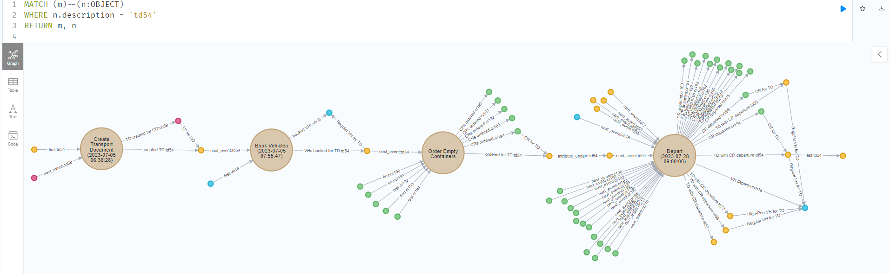

The instructions how to load data in the the Neo4j database are inside the README of the root folder. Below are some examples Cypher queries you can try out. In the resulting graph, you can double-click on a nodes to show all nodes related to it, which comes in handy for further exploration.

* Below query returns all events related to a certain object called 'td54' and object snapshots of related objects (throug object-to-object relations) at the same timestamps.

    ```
    MATCH (m)--(n:OBJECT)
    WHERE n.description = 'td54'
    RETURN m, n
    ```

* Below query returns all event types related to a certain objec type 'Truck', as well as other snapshots of related object types (through object-to-object relations that shared a timestamp).

    ```
    MATCH (m)--(n:OBJECT_SNAPSHOT_GROUPING)
    WHERE n.object_type = 'Truck'
    RETURN m, n
    ```


You can change how the nodes and edges are displayed. I like to make my event-related nodes pretty big and a single boring color (brown) and use small colorful nodes for the object snapshots - using a different color for each object type. For the caption I always use the field 'label'.
Below is a screenshot to illustrate the configuration used by me. Note that I manually made some additional nodes visible and reordered them after running the query.


